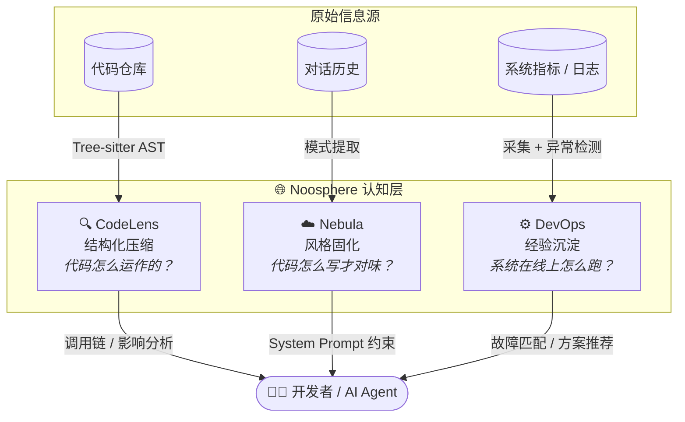

<div align="center">

# 🌐 Noosphere

**项目认知基础设施 — 让 AI 真正"理解"你的项目，而不只是"看到"它**

[](LICENSE)
[](docker-compose.yml)
[](https://go.dev)
[](https://www.python.org)
[](CONTRIBUTING.md)

*百万上下文给了 AI "看"的能力，Noosphere 给它"理解"的速度。*

[快速开始](#-快速开始) · [核心理念](#-核心理念) · [三层架构](#-三层架构) · [API 文档](docs/API.md) · [架构设计](docs/ARCHITECTURE.md)

</div>

---

## 💡 核心理念

百万 token 上下文意味着 AI **确实能"看到"整个项目**。但这就像把图书馆所有的书摊在桌上，然后说"告诉我关于量子力学的知识"——

你确实能看到所有书，但**没有索引、没有关系图谱、不知道哪本是权威、不知道第 3 章和第 17 章之间的推导关系**。你只能从头读起。

| 现状 | 代价 |
|------|------|
| 每次对话重新"读"整个项目 | 前 50K token 花在理解结构上，而非解决问题 |
| 代码是平面文本，不是结构化关系 | AI 知道有 100 个文件，但不知道谁调用了谁 |
| 风格规范不在代码里 | AI 生成符合语法但不符合团队风格的代码 |
| 运维经验在人脑里 | AI 不知道上周三同样的故障是怎么解决的 |

**Noosphere 的解法：不是给 AI 更大的记忆，而是给 AI 一个"预消化过的思维模型"。**

```
传统方式：问题 → [50K token 扫描结构] → [30K token 理解关系] → [20K token 回答]
Noosphere：问题 → [3K token 结构化上下文] → 立刻回答

           省掉 80% 浪费在"搞清楚这是个什么项目"上的 token
```

> **隐喻**：不是给 AI 一个更大的书架，而是给它一份带目录、索引、交叉引用和批注的**精装版**。
> 同样一本书，精装版让你 5 分钟找到答案，平装版让你翻 2 小时。

---

## 🏛 三层架构



### 🔍 CodeLens — 把"读代码"变成"查数据库"

AI 不用读完 342 个文件才能知道谁调用了 `authenticate()`。CodeLens 基于 Tree-sitter AST 预建了**调用图谱、继承图谱、依赖图谱**，AI 只需一次查询：

```
原始成本：读 342 个文件 ≈ 200K token
CodeLens：查询调用链 → 返回精确调用路径 ≈ 800 token

节省 99.6% 上下文，准确率反而更高。
```

### ☁️ Nebula — 把"揣摩偏好"变成"注入标准"

不需要每次解释"用 camelCase"、"错误不要 panic"、"返回格式是 `{code, data, msg}`"。Nebula 扫描代码库学习命名规范、错误处理模式、框架偏好，每次对话**自动注入为 System Prompt 约束**。

```
效果：生成代码一次过审率从 ~40% 提升到 ~85%。
```

### ⚙️ DevOps — 把"老员工的经验"变成"可检索的记忆"

线上故障的经验不写在代码里——它在聊天记录里、在运维的脑子里。DevOps 把故障诊断、解决方案、系统指标变成**持久化的情景/语义记忆**。

```
效果："上次这个报错怎么解决的" 不再需要翻聊天记录。
```

| 维度 | 🔍 CodeLens | ☁️ Nebula | ⚙️ DevOps |
|------|------------|-----------|-----------|
| **回答的问题** | 代码怎么运作的？ | 代码怎么写才对味？ | 系统在线上怎么跑？ |
| **核心指标** | 上下文节省 99.6% | 一次过审率 +45% | 故障排查时间 -80% |
| **技术核心** | Tree-sitter + 知识图谱 + RAG | 模式提取 + LSM-Tree + HNSW | 指标采集 + 异常检测 + 记忆引擎 |
| **语言** | Python | Go | Go |
| **端口** | `8765` | `8730` | `8740` |

---

## 🚀 快速开始

### 方式一：Docker 一键启动（推荐）

```bash
git clone https://github.com/your-org/noosphere.git
cd noosphere
cp .env.example .env        # 填入你的 DeepSeek API Key
docker compose up -d
```

启动后访问：

| 服务 | 地址 |
|------|------|
| 🌐 官网 | http://localhost:3000 |
| 🔍 CodeLens 控制台 | http://localhost:8765 （API 文档：http://localhost:8765/docs） |
| ☁️ Nebula 控制台 | http://localhost:8730 |
| ⚙️ DevOps 控制台 | http://localhost:8740/web/ |

### 方式二：本地开发模式

<details>
<summary><b>CodeLens</b>（需要 Python 3.10+）</summary>

```bash
cd codelens
pip install -r requirements.txt
cp config/.env.example config/.env    # 填入 API Key
python -m src.main serve              # 或直接运行 run.bat
```
</details>

<details>
<summary><b>Nebula</b>（需要 Go 1.26+）</summary>

```bash
cd nebula
set DEEPSEEK_API_KEY=sk-xxx           # Linux/macOS: export DEEPSEEK_API_KEY=sk-xxx
go run ./cmd/nebula-server --data ./nebula-data --port 8730
```
</details>

<details>
<summary><b>DevOps</b>（需要 Go 1.26+）</summary>

```bash
cd devops
go run ./cmd/devops-server --port 8740
```
</details>

---

## 🎬 三层联合工作是什么样的

```
开发者: "我准备把用户认证从 JWT 换成 OAuth2，帮我评估影响"

☁️ Nebula 注入:    当前项目使用显式 error 返回，认证中间件在 middleware/auth.go
🔍 CodeLens 注入:  auth.Middleware 被 14 个路由引用，UserModel 被 23 个函数调用
                   调用链: auth.Middleware → auth.ValidateToken → user.GetCurrentUser
⚙️ DevOps 注入:    auth 服务部署在 3 实例，平均 QPS 1200，建议灰度切换

🤖 AI 回答:        好的。需修改 middleware/auth.go（影响 14 个调用方）、
                   config/auth.go（新增 OAuth2 配置）、user/handler.go（调整获取方式）。
                   你的项目用显式 error 返回，不要用 panic。建议 staging 灰度。
```

三个典型工作流：

```bash
# 1. Nebula 学习你的代码风格
nebula ingest --dir ./my-project
# → 语言: Go(78%) TS(22%) | 命名: PascalCase 导出 | 错误处理: 显式 error，无 panic

# 2. CodeLens 索引项目结构
codelens index --project ./my-project
# → 342 文件 | 8,521 实体 | 12,433 关系 | 调用/继承/依赖图谱就绪

# 3. DevOps 诊断线上异常
devops diagnose "最近 1 小时 CPU 异常"
# → 匹配到上周四类似故障模式 → 数据库连接池耗尽 → 解决方案已检索
```

---

## 📁 项目结构

```
noosphere/
├── docker-compose.yml       # 一条命令拉起全部服务
├── .env.example             # 统一配置模板（复制为 .env）
├── codelens/                # 🔍 代码结构图谱 + RAG 问答（Python）
│   ├── src/                 #    parser / indexer / rag / agent / api
│   └── Dockerfile
├── nebula/                  # ☁️ 风格学习 + 记忆引擎（Go）
│   ├── engine/              #    LSM-Tree + HNSW + BM25 + RRF
│   ├── analyzer/            #    代码扫描与风格提取
│   └── Dockerfile
├── devops/                  # ⚙️ 运维记忆 + 故障诊断（Go）
│   ├── metrics/ analyzer/   #    指标采集 / 日志异常检测
│   ├── memory/              #    故障经验存储
│   └── Dockerfile
├── web/                     # 🌐 官网前端（Next.js 14 + Three.js）
│   ├── src/                 #    Hero 3D 场景 / HUD 遥测 / 产品矩阵
│   └── Dockerfile           #    连接三服务真实状态，:3000
└── docs/
    ├── ARCHITECTURE.md      # 深度架构设计
    └── API.md               # 三服务完整 REST API 参考
```

---

## ❓ 常见问题

<details>
<summary><b>需要什么 API Key？收费吗？</b></summary>

三个服务共用一个 [DeepSeek API Key](https://platform.deepseek.com/api_keys)（用于 RAG 问答、风格分析和故障推理）。不配置 Key 时，索引、图谱查询、记忆存储等**非 LLM 功能依然可用**。
</details>

<details>
<summary><b>我的代码会被上传吗？</b></summary>

不会。所有索引、图谱、记忆都存储在**本地**（LSM-Tree / ChromaDB / 本地卷）。只有你主动发起的问答会把**相关片段**（不是整个代码库）发送给 LLM。
</details>

<details>
<summary><b>三个服务必须一起用吗？</b></summary>

不必须。每个服务完全独立，可单独启动（`docker compose up -d nebula`）。一起用时通过各自的 HTTP API 组合出完整的"项目认知层"。
</details>

<details>
<summary><b>端口被占用了怎么办？</b></summary>

修改 [docker-compose.yml](docker-compose.yml) 中的端口映射左侧值即可，例如 `"9765:8765"`。
</details>

---

## 🗺 Roadmap

- [x] 三服务 Docker 化 + Compose 一键启动
- [x] 统一环境配置与密钥安全读取
- [ ] GitHub Actions CI（构建 + 测试 + 镜像发布）
- [ ] 服务间共享数据协议（Nebula ↔ CodeLens ↔ DevOps 摘要互通）
- [ ] MCP Server 模式（接入 Claude Code / Cursor 等 AI 编程工具）
- [ ] 多语言风格模板市场

---

## 🤝 贡献

欢迎 Issue 和 PR！请先阅读 [CONTRIBUTING.md](CONTRIBUTING.md)。

## 📄 License

[MIT](LICENSE) © 2026 Noosphere Contributors
