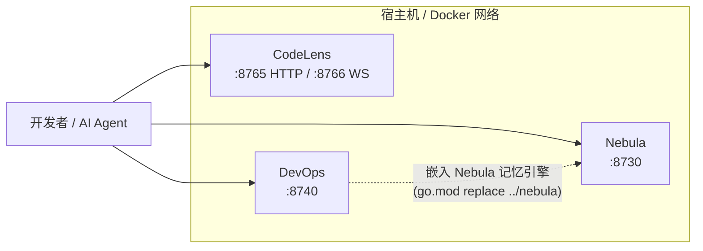
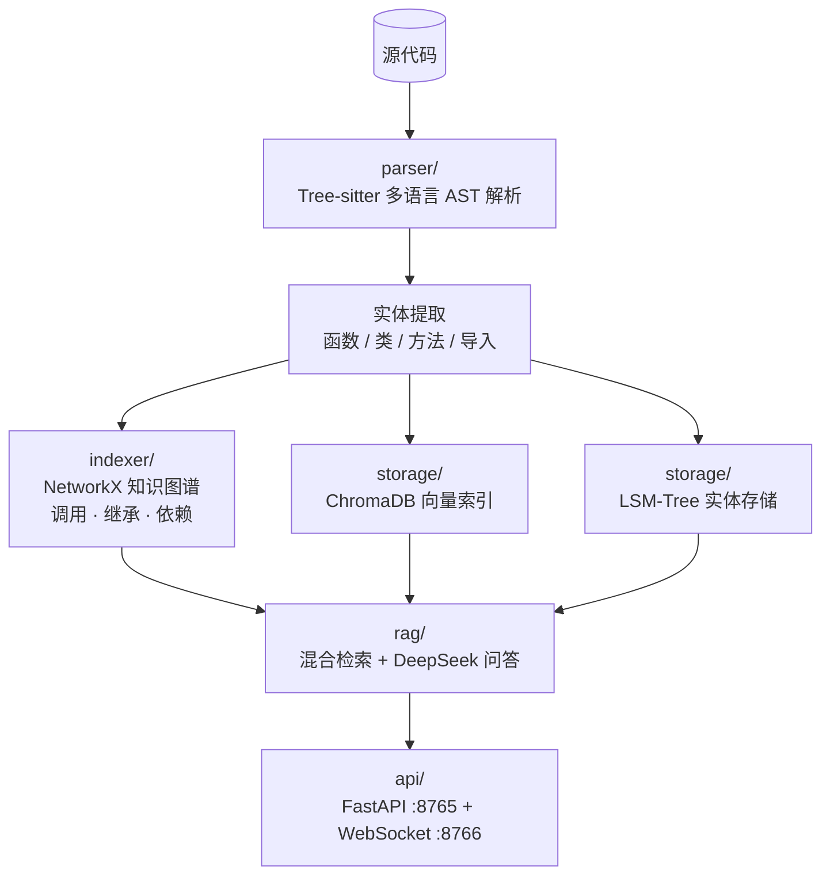
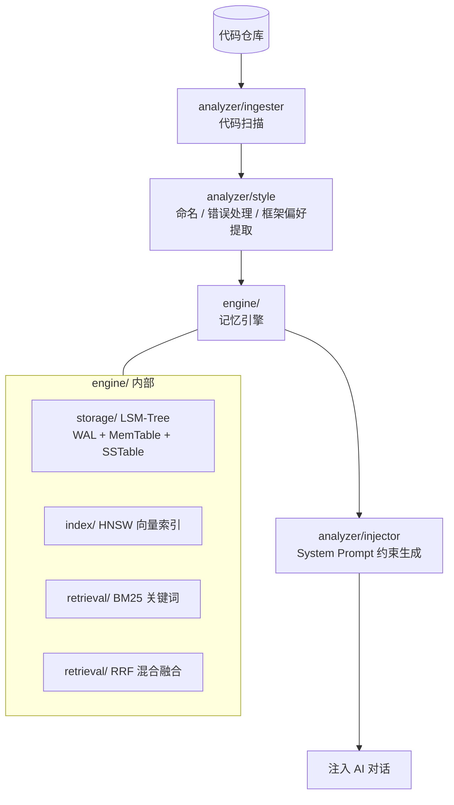
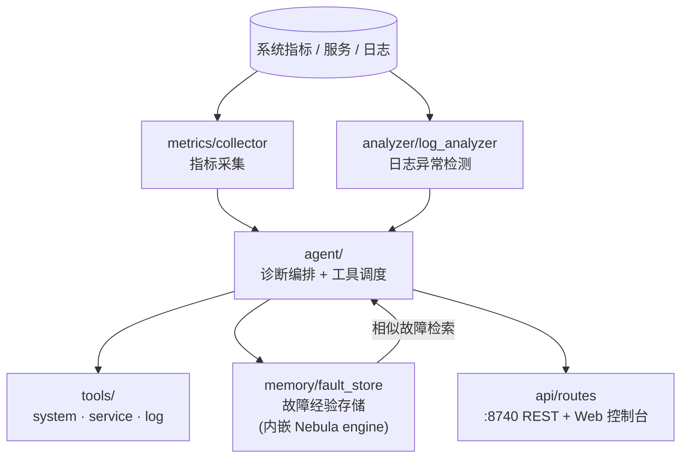

# 架构设计

> Noosphere 的目标不是"更大的记忆"，而是**更高的单位 token 信息密度**。
> 本文描述三个服务的内部架构、数据流与设计取舍。

---

## 总体拓扑

- 三个服务**互不阻塞**：任意一个宕机不影响其他两个。
- DevOps 在编译期以 Go module 方式嵌入 Nebula 的 `engine` 包（源码级复用，非网络调用）。
- 端口分配：`8730`（Nebula）、`8740`（DevOps）、`8765/8766`（CodeLens），互不冲突。

---

## Layer 1 — CodeLens（Python）

**职责：把平面代码变成可查询的结构化图谱。**

| 组件 | 技术 | 作用 |
|------|------|------|
| 解析层 | Tree-sitter（7 种语言） | 语法级精确解析，非正则匹配 |
| 图谱层 | NetworkX | 调用图 / 继承图 / 依赖图，支持 N 度关系遍历 |
| 存储层 | LevelDB (LSM-Tree) + ChromaDB | 实体 KV 存储 + 语义向量检索 |
| 问答层 | DeepSeek + 混合 RAG | 图谱检索 + 向量检索 → 结构化上下文 → LLM |

**关键设计**：查询"谁调用了 X"不走 LLM，而是图谱 O(1) 查询——这是 99.6% token 节省的来源。LLM 只在最后一步做自然语言综合。

---

## Layer 2 — Nebula（Go）

**职责：学习代码风格，形成可注入的约束；同时是一个通用嵌入式记忆引擎。**

| 组件 | 技术 | 作用 |
|------|------|------|
| 存储引擎 | 自研 LSM-Tree（WAL 保障持久化） | 高写入吞吐的记忆存储 |
| 向量检索 | HNSW | 近似最近邻语义检索 |
| 关键词检索 | BM25 | 精确术语匹配 |
| 融合排序 | RRF（Reciprocal Rank Fusion） | 语义 + 关键词双路召回融合 |
| Embedding | 可插拔（mock / Ollama / OpenAI 兼容） | `--embedder` 参数切换 |

**关键设计**：`engine` 包零外部依赖、可嵌入（DevOps 就是第一个宿主）。服务模式与嵌入模式共用同一套引擎代码。

---

## Layer 3 — DevOps（Go）

**职责：把一次性的故障处理变成可复用的组织记忆。**

| 组件 | 作用 |
|------|------|
| `metrics/` | CPU / 内存 / 磁盘 / 网络指标采集 |
| `analyzer/` | 日志模式识别 + LLM 根因推理 |
| `tools/` | 可注册的运维工具框架（系统 / 服务 / 日志三类内置） |
| `memory/` | 故障 → 诊断 → 解决方案 三元组持久化，支持语义检索 |

**关键设计**：诊断时**先检索历史故障记忆**再调用 LLM——"上周见过的故障"直接命中方案，无需重新推理。

---

## 数据与安全

| 事项 | 策略 |
|------|------|
| API Key | 只从环境变量 / `.env` 读取，源码零硬编码；`.env` 被 `.gitignore` 与 `.dockerignore` 双重排除 |
| 数据落盘 | 全部本地：CodeLens → Docker 卷 `codelens-data`；Nebula → `nebula-data`；DevOps → `devops-memory` |
| 出网流量 | 仅问答/诊断时向 `api.deepseek.com` 发送相关片段，索引与检索全程本地 |
| 容器构建 | Go 服务多阶段构建（`golang:1.26-alpine` → `alpine:3.20`），产物 ~10MB；`CGO_ENABLED=0` 静态编译 |

## 构建细节备忘

- **DevOps 的构建上下文必须是仓库根目录**：它通过 `replace github.com/nebula-agent/nebula => ../nebula` 引用 Nebula 源码。`docker-compose.yml` 已将其 `context` 设为 `.`，`dockerfile` 设为 `devops/Dockerfile`。
- 两个 Go 服务的 Web 控制台从工作目录 `./web` 提供静态文件，运行镜像中已按此布局放置。
- CodeLens 的 `plyvel` 依赖 LevelDB C 库，Dockerfile 中通过 `libleveldb-dev` 解决；本地安装失败时可用 `run.bat` 的最小安装模式跳过。
